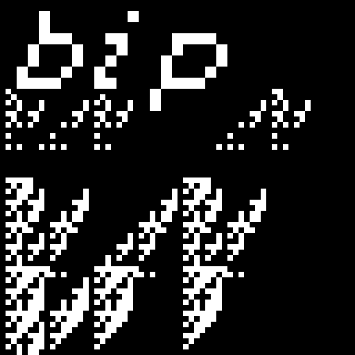

---

`bip` is a very tiny algorithmic image generator that can be used to make interesting patterns with pixels. The magic in `bip` lies in the recursive tree structure it uses to generate a random expression, which is then evaluated to a single integer for each pixel, and written to the 2d array to make the output image. The image will be output to the current working directory from which `bip` was called, and then can be opened with an image viewer.

This repo also comes with a couple useful scripts to make using `bip` more ergonomic. The main one is called `build`, which can be used for several operations, but the main purpose is to compile, execute, and open the image in an image viewer all in one command. It can also be used to just run `bip` and open the image (after it's been compiled), and to install the program if you like it. The other main script is called `bop` (naturally), and it's designed to be used exactly like `bip`, except it automatically opens the resulting image file in your image viewer after it's been generated. Additionally, `bop` can be used to convert the image to another file format.

More details on these scripts and `bip` in general can be found below.

---

## build script & installation

I didn't feel like using `make` because this is such a small project, but I ended up overengineering an install script anyway... 

The script is called `build` and can be run with `./build make` in the root directory of the repo. I initially made it to make it easier to test during development, so it works well if you just want to quickly run the program and see what it does. If you like it, you can use the script to install it to your `~/.local/bin` directory. Make sure `~/.local/bin` is in your `$PATH` in order to call it from the command line.

`bip` does not use any external dependencies and only relies on the standard C library to compile. I tried to make it as portable as possible, so I figured that having users compile it themselves would be the best route, and it should be able to be compiled on any system out of the box. I've been using it on macOS, Void Linux musl and glibc, and OpenBSD.

So the build script should work on any Unix, including the automatic image opening functionality. On any non-mac Unix, it will try `nsxiv`, `feh`, and then `xdg-open`, in that order (I wanted to pass flags to disable anti-aliasing before falling back to `xdg-open`). On macOS it just uses the built in `open` command, which should open Preview for bmps, and then try `$EDITOR`, `vim`, or TextEdit for xpms, in that order. Unfortunately there aren't any mac apps that can view xpms as images, though you can use `feh` or `nsxiv` with an x11 compatibility layer like X11 from macports or XQuartz. The build script was written for Unix so I doubt it'll work on Windows, but I think you should still be able to compile `bip` manually.

#### install instructions:

1. run `./build make` to compile, execute, and open the resulting image all in one go.
2. after it's compiled, you can run `./build run` to just execute and open the resulting image.
3. run `./build install` to install `bip` and `bop` to your `~/.local/bin` directory.
4. to uninstall, run `./build uninstall`, or just delete the two bip bops from `~/.local/bin`.

```
  build [subcommands: run, install, clean, ... ]

  this script offers a simple way to compile, run, and install bip.

  subcommands:

      build make      - compiles the program, runs it, and opens the resulting image
      build run       - runs the program & opens the resulting image (must be compiled)
      build install   - moves bip and the bop script to ~/.local/bin and runs build clean
      build uninstall - removes bip and bop from ~/.local/bin
      build clean     - removes the image files and binary from this directory
      build help      - displays this help message

  to pass cli args to bip itself, write them after the build script's subcommand.
  for instance, to change the name of the generated image file, run:

      ./build make --name=boppajam

  the --name flag will be passed to bip when ./build make runs it, after it compiles it.
  then it will automatically open your silly new boppajam.bmp file!
  to see a full list of bip's cli options, run ./build run --help, or just ./bip --help
  to call the binary directly, after it's been compiled.
```

---

## `bip` usage

It's a dead simple program to use. You just run it with `bip` and it will drop a bitmap file made with a randomly generated algorithm in your current directory, and the expression it used will be printed to stdout.

The default image parameters are a bitmap with a size of 256x256px, and the expression it uses will have a recursion depth of 2 – 5 branches (the structure of expression generation algorithm is given below). You can change all the parameters with cli flags. The only filetypes that `bip` supports are bitmaps (`.bmp`) and X-PixMaps (`.xpm`), but you can convert to a compressed image format easily with the `bop` script, outlined later in this readme.

As mentioned earlier, the way bip works is by generating a random expression, which is evaluated and written to the image file each pixel at a time. The expression is generated using a recursive algorithm that randomly selects variables and operators from a list. Currently, the available variables are `x`, `y`, and `c`, with `x` and `y` being the 2d position values in the image, and `c` being a constant. The available operators are the normal `+`, `-`, `*`, `/`, and `%` (modulo) operations, as well as the bitwise operations `&`, `|`, `^`, `>>`, and `<<`. Generally, the longer the expression, the more complex the resulting image will be. Some care has been taken to prevent mathematical problems (like divide by zero errors), but sometimes the resulting image will end up being just black or white. Just run it again until you get something cool.

Running `bip` without any flags will generate a decent range of variation (according to the defaults described above), but there are also several parameters exposed as command line flags. When the parameters are parsed, they're internally clipped into sane ranges to avoid blowups. The available options are:
- width and height: specified in pixels, clipped to the range 16 – 8192.
- depth: the number of recursive iterations used to generate the expression. Generally, the higher the depth, the longer and more complex the expression will be. Clipped to the range 2 – 12.
    - 2 is the minimum because that is the amount of recursion needed for a full expression, like `(x + y)`
    - 12 is the maximum because it needs to be cut off somewhere, and 12 will make a very, very long expression.
- random: the level of randomness introduced to the depth parameter. The number specified here is the maximum offset value, and the offset will be added to the depth parameter. Clipped to the range 0 – 6.
    - for instance, if `--random=2`, then the offset can either be 0, 1, or 2. Then, that random number is added to depth.
    - this makes it so that when used together, depth represents the minimum recursion depth, and depth + random represents the maximum.
    - so each run of `bip` will use an expression of a different length, and random will just make the range of expression lengths wider.
- threshold: the number above which will write a white pixel, and below which will write a black pixel. Clipped to range 1 – 255.
- name: the name of the output file. The file extension is added automatically, but it's also checked for if the user adds it in.
- xpm: if this flag is given, the image format bip uses will be xpm.
    - conveniently, since xpm files use plain text, the expression will be included as a comment in the file.

```
  usage: bip [options]

  bip generates an expression using a recursive tree structure,
  which is evaluated and written to each pixel in the output file.

  options:

      --width,  -w <int> (256)          - width in pixels
      --height, -i <int> (256)          - height in pixels
      --depth,  -d <int> (2)            - number of iterations in tree
      --random, -r <int> (4)            - random offset to depth param
      --thresh, -t <int> (5)            - threshold for white/black pixels
      --xpm,    -x                      - generates a .xpm file instead of .bmp
      --name,   -n <str> ("bitty.bmp")  - name of output image file
      --help,   -h                      - displays this help message

  examples:

      bip --depth=4 --random=0 --name=boppajam

  this will generate an image named 'boppajam.bmp' using an expression
  that's always the same length, at a recursion depth of 4.

      bip -d 2 -r 6 -w 1024 -i 1024 -x

  this will generate a 1024x1024 size XPM that uses an expr with a minimum
  recursion depth of 2, but can go much deeper with a high randomness level.
```

### diagram

Here's a diagram of the recursion algorithm:

```
                           ┌─────────────┐                                                                                  ┌─────────────────────────────────────────┐
                           │ (l   ?   r) │ -------------------------------->                   (a ? b)                     ─┘ each operand is a leaf, the combination │
                           └──┼───────┼──┘                                                                                 ─┐ of a left and right operand plus an     │
                ┌─────────────┘       └─────────────┐                                                                       │ operator is a branch.                   │
         ┌──────┼──────┐                     ┌──────┼──────┐                                                                ├─────────────────────────────────────────┤
         │ (ll  ?  lr) │                     │ (rl  ?  rr) │ -------------->             ((a ? b) ? (c ? d))               ─┘ a leaf can become a branch. the amount  │
         └──┼───────┼──┘                     └──┼───────┼──┘                                                               ─┐ of generated branches is given by the   │
       ┌────┘       └────┐                 ┌────┘       └────┐                                                              │ depth parameter.                        │
┌──────┼──────┐   ┌──────┼──────┐   ┌──────┼──────┐   ┌──────┼──────┐                                                       ├─────────────────────────────────────────┤
│ (lll ? llr) │   │ (lrl ? lrr) │   │ (rll ? rlr) │   │ (rrl ? rrr) │ -----> (((a ? b) ? (c ? d)) ? ((e ? f) ? (g ? h)))   ─┘ branches are made with recursive calls  │
└─────────────┘   └─────────────┘   └─────────────┘   └─────────────┘                                                      ─┐ to the generator function from within   │
┌─────────────────────────────────────────────────────────────────────────────────────────────────────────────────────────┐ │ itself, depending on the depth param.   │
│ the diagram above depicts the relationship that the generations have with their progenitors, inheriting the status of   │ │ depth is decremented on each iteration  │
│ left or right and appending the new status to the end. the expression that these relationships result in is shown by    │ │ so that a branch always terminates in   │
│ the arrows, depicting nested branches of operands with question marks in place of randomly selected operators.          │ │ two leaves once depth falls below one.  │
└─────────────────────────────────────────────────────────────────────────────────────────────────────────────────────────┘ └─────────────────────────────────────────┘
```

---

## `bop` usage

`bop` is basically a wrapper script for `bip`, so you can used all of `bip`'s command line flags with it. The difference is that `bop` will automatically open the image in your image viewer (much like the `build` script). Additionally, you can use `bop` to convert the image into a more convenient format. This functionality depends on ImageMagick though, so make sure you have that installed if you want to use it.

An example usage of `bop` would be:

```
bop --width=128 --height=128 --name=bubble --depth=6 --random=0
```

"Wow, now that `bop` has conveniently opened my new `bubble.bmp` file in my image viewer, I love it! But, I think I'd rather have it as a png file instead..."

```
bop convert png
```

"That's better! Now, time to show off my new `bubble.png` file online for all to see!"

>[!note]
> `bop` acts on all bmp and xpm files in your current directory, so it will both open and convert all of them. But it won't also delete the original versions after conversion. And again, ImageMagick is needed for the conversion function.

---


Check out the [gallery](assets/gallery.md) to see what kinda nonsense `bip` does.

---

#### acknowledgements
[bit](github.com/superstarryeyes/bit) - fucking awesome meta-font playground that i used in the logo

[bit art bot](https://freeradical.zone/@bitartbot) - a bot on mastodon that generates similar images, written in ruby

[timClicks](https://www.youtube.com/live/KGIGbU6dDFE?si=47tzUBFq0Y3e4Dm4) - a rust tutorial for implementing the basic functionality, which was inspired by the bit art bot above, and which originally got me interested in trying it in c

---

#### license
BSD 2-Clause, copyright B. R. Shellito. See [license](LICENSE.md) for details.

---

This project was just an exercise for me while I try learning c. If you have advice for better programming practices or whatever, let me know.
