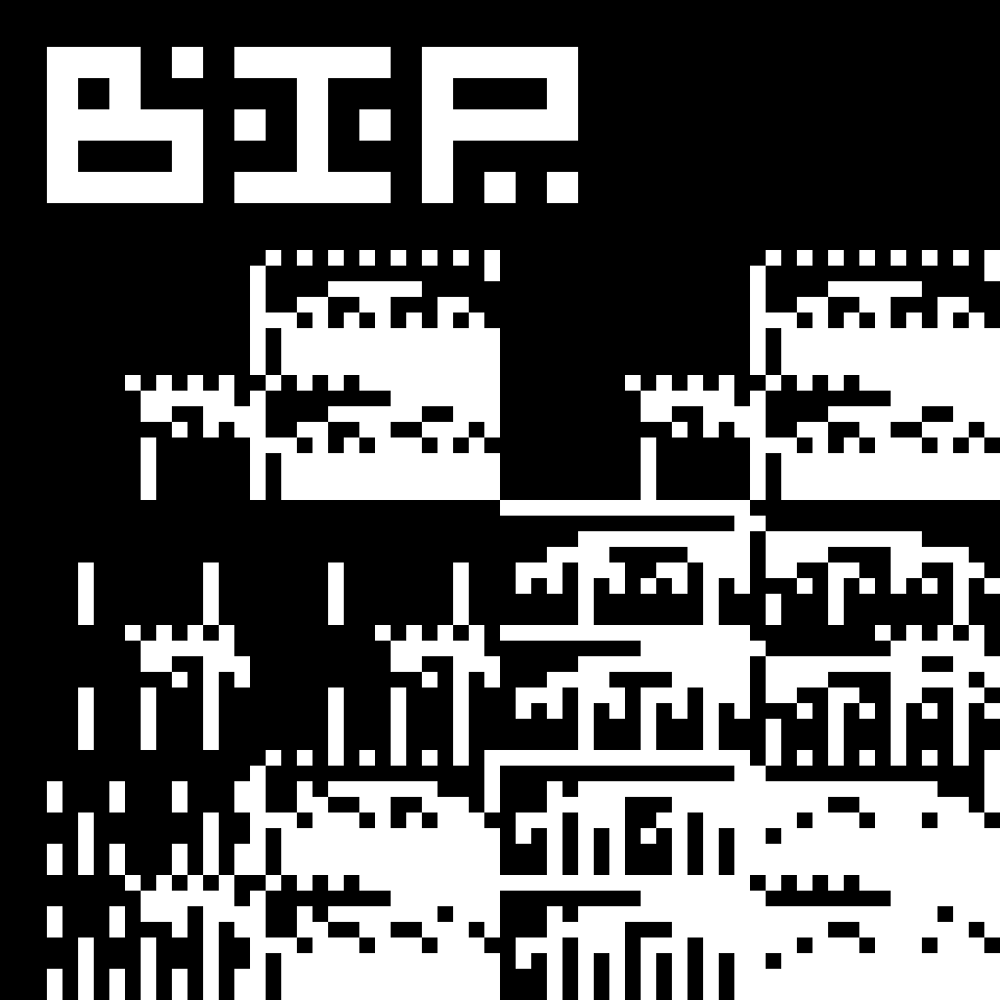

---

`bip` is an algorithmic image generator that can be used to make interesting patterns with pixels. The magic in `bip` lies in the recursive tree structure it uses to generate an expression, which is then evaluated to a single integer for each pixel, and written to the 2d array to make the output image. The image will be output to the current working directory from which `bip` was called, and then can be opened with an image viewer.

This repo has a `build` script that when run, will automatically compile, execute, and open the image in an image viewer. After it's been compiled, you can use `build` to just run the program and open the resulting image with `./build run`.

---

### diagram of recursive tree

```
                           ┌─────────────┐                                                                                  ┌─────────────────────────────────────────┐
                           │ (l   ?   r) │ -------------------------------->                   (a ? b)                     ─┘ each operand is a leaf, the combination │
                           └──┼───────┼──┘                                                                                 ─┐ of a left and right operand plus an     │
                ┌─────────────┘       └─────────────┐                                                                       │ operator is a branch.                   │
         ┌──────┼──────┐                     ┌──────┼──────┐                                                                ├─────────────────────────────────────────┤
         │ (ll  ?  lr) │                     │ (rl  ?  rr) │ -------------->             ((a ? b) ? (c ? d))               ─┘ a leaf can become a branch. the amount  │
         └──┼───────┼──┘                     └──┼───────┼──┘                                                               ─┐ of generated branches is given by the   │
       ┌────┘       └────┐                 ┌────┘       └────┐                                                              │ depth parameter.                        │
┌──────┼──────┐   ┌──────┼──────┐   ┌──────┼──────┐   ┌──────┼──────┐                                                       ├─────────────────────────────────────────┤
│ (lll ? llr) │   │ (lrl ? lrr) │   │ (rll ? rlr) │   │ (rrl ? rrr) │ -----> (((a ? b) ? (c ? d)) ? ((e ? f) ? (g ? h)))   ─┘ branches are made with recursive calls  │
└─────────────┘   └─────────────┘   └─────────────┘   └─────────────┘                                                      ─┐ to the generator function from within   │
┌─────────────────────────────────────────────────────────────────────────────────────────────────────────────────────────┐ │ itself, depending on the depth param.   │
│ the diagram above depicts the relationship that the generations have with their progenitors, inheriting the status of   │ │ depth is decremented on each iteration  │
│ left or right and appending the new status to the end. the expression that these relationships result in is shown by    │ │ so that a branch always terminates in   │
│ the arrows, depicting nested branches of operands with question marks in place of randomly selected operators.          │ │ two leaves once depth falls below one.  │
└─────────────────────────────────────────────────────────────────────────────────────────────────────────────────────────┘ └─────────────────────────────────────────┘
```

## installing

I didn't feel like using `make` because this is such a small project, but I ended up overengineering an install script anyway... 

The script is called `build` and can be run with `./build make` in the root directory of the repo. I initially made it to make it easier to test during development, so it works well if you just want to quickly run the program and see what it does. If you like it, you can use the script to install it to your `~/.local/bin` directory. Make sure `~/.local/bin` is in your `$PATH` in order to call it from the command line.

#### install instructions:
1. run `./build make` to compile, execute, and open the resulting image all in one go.
2. after it's compiled, you can run `./build run` to just execute and open the resulting image.
3. run `./build install` to install the binary and a version of the `run` portion of the script to `~/.local/bin` (`bip` and `bop`, respectively (naturally)).
4. to uninstall, run `./build uninstall`, or just delete the two bip bops from `~/.local/bin`.

```
  build [subcommands: run, install, clean, ... ]

  this script offers a simple way to compile, run, and install bip.

  subcommands:

      build make      - compiles the program, runs it, and opens the resulting image
      build run       - runs the program & opens the resulting image (must be compiled)
      build install   - moves bip and the bop script to ~/.local/bin and runs build clean
      build uninstall - removes bip and bop from ~/.local/bin
      build clean     - removes the image files and binary from this directory
      build help      - displays this help message

  to pass cli args to bip itself, write them after the build script's subcommand.
  for instance, to change the name of the generated image file, run:

      ./build make --name=boppajam

  the --name flag will be passed to bip when ./build make runs it, after it compiles it.
  then it will automatically open your silly new boppajam.bmp file!
  to see a full list of bip's cli options, run ./build run --help, or just ./bip --help
  to call the binary directly, after it's been compiled.
```

---



Check out the [gallery](assets/gallery.md) to see what kinda nonsense `bip` does.

---

#### acknowledgements
[bit](github.com/superstarryeyes/bit) - fucking awesome meta-font playground that i used in the logo

[bit art bot](https://freeradical.zone/@bitartbot) - a bot on mastodon that generates similar images, written in ruby

[timClicks](https://www.youtube.com/live/KGIGbU6dDFE?si=47tzUBFq0Y3e4Dm4) - a rust tutorial for implementing the basic functionality, which was inspired by the bit art bot above, and which originally got me interested in trying it in c

---

#### license
BSD 2-Clause, copyright B. R. Shellito. See [license](LICENSE.md) for details.

---

This project was just an exercise for me while I try learning c. If you have advice for better programming practices or whatever, let me know.
