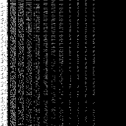
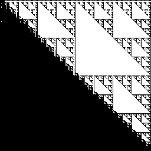
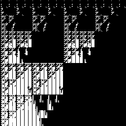
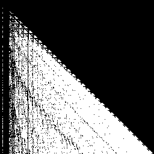
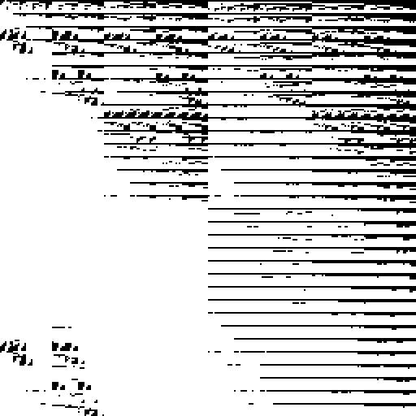
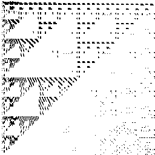
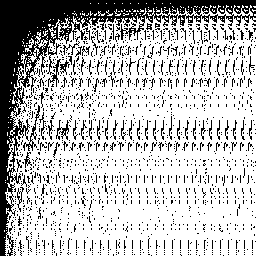
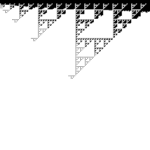
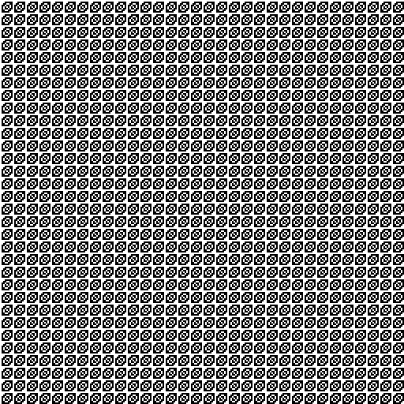
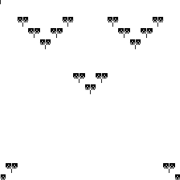

> columns, ((((c & x) << (c * x)) - ((y ^ c) / (y * c))) - (((x - c) & (x - c)) << ((x * y) >> (y % x)))), c = 12

> fascia, ((((c * y) >> (x / x)) * ((y * c) * (x % y))) | (((c & x) | (y + x)) - ((x / y) ^ (y + x)))), c = 17

> mountains, ((((c << x) >> (y >> c)) / ((y >> x) & (x ^ c))) | (((x - y) ^ (c & y)) % ((c / y) | (y ^ x)))), c = 5

> swamp, ((((c / y) ^ (y + y)) >> ((x << x) & (c % y))) / (((x | x) & (y | c)) ^ ((c * c) / (y & x)))), c = 14

> dread, ((((c ^ x) * (y - x)) >> ((c - y) | (y % x))) % (((c * c) >> (c ^ x)) | ((c & x) | (c - x)))), c = 6

> ridges, ((((x / x) | (y - y)) ^ ((c * c) | (c << c))) ^ (((y / c) - (c ^ x)) + ((x >> y) ^ (y | x)))), c = 3

> ghost, ((((y & x) % (c | y)) + ((y & c) << (x + x))) + (((c | x) >> (y % x)) << ((x ^ x) & (x & x)))), c = 16

> arc, ((((y & y) - (c << x)) & ((y << x) >> (y / y))) % (((c - x) & (c / y)) | ((x * y) >> (y | c)))), c = 15

> dwindle, (((y & y) % (c << c)) - ((x + c) / (x & y))), c = 7

> wallpaper, (((y * x) & (y ^ y)) | ((c & c) >> (y * x))), c = 24

> rag, (((y + c) ^ (c / c)) ^ ((c + x) & (c - x))), c = 24
